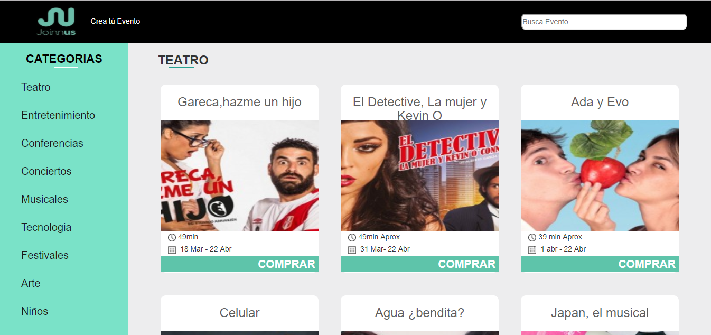
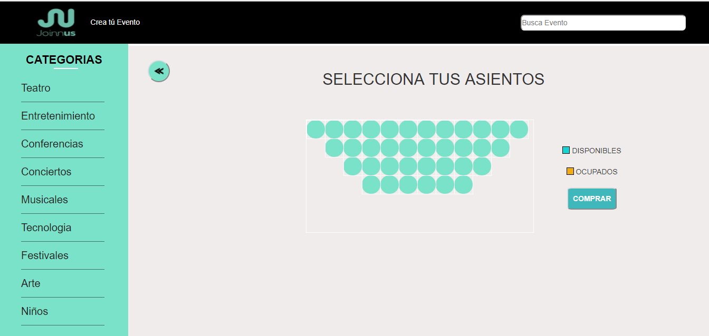

# BUYTICKET (JOINNUS)

## Objetivo:

- Desarrollar una plataforma que permita realizar la compra de tickets  para eventos de tipo teatro,considerando que los escenarios pueden tener mas de un piso.

## Desarrollado para [Laboratoria](http://laboratoria.la)
## Flujo

- Identificar los componentes de la vista principal.

- Identificar las acciones y los estados de nuestra vista principal.

- Se identifico la accion **SELECCIONAR_SECCION** y mediante el evento click se muestra la siguiente vista,donde se seleccionará las butacas para la compra de tickets.

- Para navegar entre la vista primncipal y la vista de selección de asientos,se creo una nueva acción llamada **NAVIGATOR_TO** que nos permite interactuar con las páginas.

## Demo

## Principales Herramientas
- React
- Redux

## Participantes
- Melyna Pernia
- Marina Rodriguez